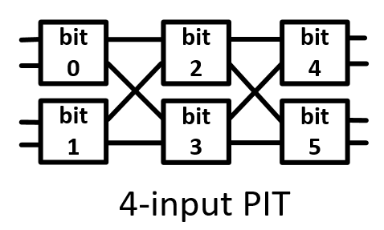
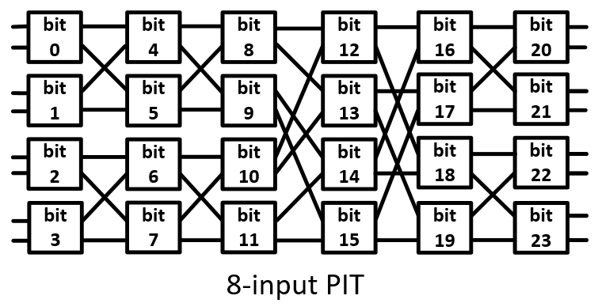
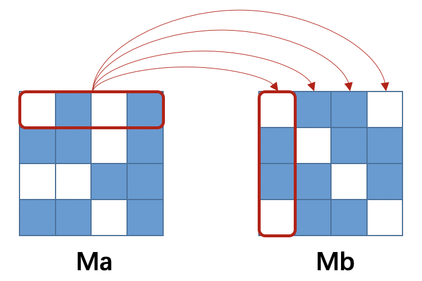
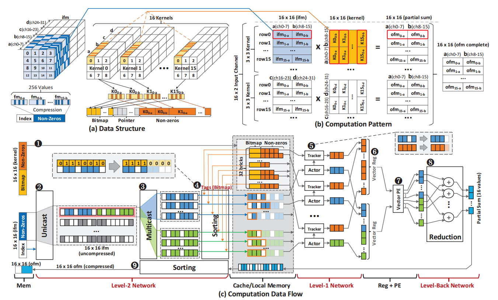

# PIT Primitive Spec-v1.1

## Version Update Instruction

| Date       | Version | Introduction                                  |
| ---------- | ------- | --------------------------------------------- |
| 2021.01.29 | v1.0    | First created                                 |
| 2021.03.02 | v1.1    | Some functions are deleted, added and changed |
| 2021.03.16 | v1.2    | Save functions added and other changes        |

* Modification in v1.1:

  > * Delete the `bmask` option in load functions. #Finished
  > * Add two new function: `split`and `merge`, which can spit and merge the elements of the ***Vector*** in bytes. #Finished
  > * Add a new option: `expand`, which indicates whether the data-width of the elements in the returned ***Vector*** is longer than that of the elements in the original one. #Finished
  > * Add a new option: `source<size>` , which can be used in the function `mskselect`. #Finished
  > * Change the input of some functions from pointer to data itself. #Finished
  > * Replace the function `actcsort` with two new functions: `acsort` and `tcsort`. #Finished
  > * Add a new data type: ***Ctrlword***, which can be used as the control word of the transmission process. #Finished
  > * Add a new option: `block<size_x>x<size_y>x<size_z>`, which can show the data structure information. #Finished
  > * Add a new option: `axis<xyz>`, which can show the order of the axes after transpose. #Finished
  > * Change `transpose` to support the transpose of 2d-array and 3d-array. #Finished
  > * Add a new function: `reorder`, which can support data reordering with ***Ctrlword***. #Finished
  > * Add two options: `max` and `min`, which can be used in the sorting functions. #Finished
  > * Change the function `sum` to support the `bmask` option. #Finished

* Modification in v1.2:

  > * Add a new option: `bbmask` , which can get the available situation of the each bit of every element. #Finished
  > * Change `mskselect` to support `bbmask`. #Finished
  > * Add two new options: `compress` and `decompress`. Compress the data when save it to memory and decompress the data when load it from the memory. #Finished
  > * Add a new function: `save`, save data to memory. #Finished
  > * Delete the ***Constant*** data type. #Finished
  > * Add a new option: `inbit` for `uniload` and `unisave`, which can help loading or saving data as the elements in bit. #Finished
  > * The output data format of `mskselect` is specified. #Finished
  > * Add a new Instance for Sparse DNN. #Achieve Phased Goals


## Data Types

### Overview

| Types          | Conventions                       | Examples                                                     |
| -------------- | --------------------------------- | ------------------------------------------------------------ |
| ***Vector***   | `__p<element_nums><element_type>` | `__p6b`,`__p2c`, `__p4s`,`__p8i`, `__p16l`,  `__p32f`, `__p64d` ... |
| ***Mask***     | `__pmask<bit_width>`              | `__pmask16`, `__pmask64` ...                                 |
| ***Ctrlword*** | `__pctrlw<ctrl_size>`             | `__pctrlw2`, `__pctrlw4`, `__pctrlw8`, `__pctrlw116` ...     |

> The head file which can support the PIT system  is `<pitsys.h>`, it should be included at the beginning of the source code.


### ***Vector*** 

* Convention:  `__p<element_nums><element_type>`

  >* `__p` is the flag of the data for PIT system.
  >
  >* `<element_nums>` is the number of the element in the vector, it can be replaced with the value of $2^k$ ($1\leq k\leq8$).
  >
  >* `<element_type>` is the type of the element int the vector, it can be selected from the [table1](#table1) below: 
  >
  >| Options | Element Types | Bit_width |
  >| ------- | ------------- | --------- |
  >| `c`     | char          | 8bit      |
  >| `s`     | short         | 16bit     |
  >| `i`     | int           | 32bit     |
  >| `l`     | long          | 64bit     |
  >| `f`     | float         | 32bit     |
  >| `d`     | double        | 64bit     |
  >

* Description and Usage

  Data examples: `__p8i`, `__p32f`, `__p64d`

  > * `__p8i` is composed of 8 integer(32-bit) elements.
  > * `__p32f` is composed of 32 single-precision (32-bit) floating-point elements.
  > * `__p64d` is composed of 64 double-precision (64-bit) floating-point elements.

  Take `__p8i` as an application:

  `__p8i <name> = {<name>[0], <name>[1], <name>[2], ... , <name>[7]}`

  > * `<name>` is the name of the vector, can be specified by the user.
  > * `<name>[<idx>]` is the `integer` element in the vector, each element in the vector can be indexed with ordinal number.


### ***Mask***

* Convention: `__pmask<bit_width>`

  >* `__pmask` is the flag of the mask data for PIT system.
  >* `<bit_width>` is the width of the mask data in bits.

* Description and Usage

  Data examples: `__pmask16`, `__pmask64`

  > * `__pmask16` is the 16-bit mask data.
  > * `__pmask64` is the 64-bit mask data.

  Take `__pmask16` as an application:

  `__pmask16 <name> = <0x0 ~ 0xffff>`

  > * `<name>` is the name of the mask data, can be specified by the user.
  > * `<0x0 ~ 0xffff>` means the value of the mask data is range from `16'h0000` to `16'hffff`.
  > * Each bit in the mask data can represent whether the corresponding element in the vector is available and also sometimes used to indicate the availability of individual bytes of elements in a vector. The use of mask depends on the definition in the function.
  > * `<name>.bit<index>` is the method for indexing the `<index>`<sup>th</sup> bit of the ***Mask***.


### ***Ctrlword***

* Convention:`__pctrlw<ctrl_size>`

  > * `__pctrlw` is the flag of  the control data for PIT system.
  >
  > * `<ctrl_size>` is the input size of the SOM component that can be taken over by the control word，it can be replaced by $2^k$ ($1\leq k\leq8$).
  >
  > * The actual data width of the control word is  $\frac{(k+1)k}{2}\cdot2^{k-1} $-bit.
  >
  > * Each bit in the control word indicates the status of the switch unit in PIT system (1'b1: cross, 1'b0:straight).
  >
  >   > `__pctrlw4` can be used to indicate the status of 6 switchs in 4-input PIT as shown in following figure:
  >   >
  >   > `__pctrlw8` can be used to indicate the status of 24 switchs in 8-input PIT as shown in following figure:

* Description and Usage

  Data examples: `__pctrlw4`, `__pctrlw8` ...

  > * `__pctrlw4` is composed of 6 bits.
  > * `__pctrlw8` is composed of 24 bits.

  Take `__pctrlw4` as an application:

  `__pctrlw4 <name> = <0x0 ~ 0x3f>`

  > * `<name>` is the name of the control data, can be specified by the user.
  > * `<0x0 ~ 0x3f>` means the value of the constant data is range from `6'b00_0000` to `6'b11_1111`, this range is depends on the width of the control word.


## Function

### Overview

| Categories        | Functions                              | Description                                                  |
| ----------------- | -------------------------------------- | ------------------------------------------------------------ |
| Load              | `uniload`<br>`sload`<br>`idxload`      | Take over the ordinary data as PIT specific data with different modes |
| Save              | `unisave`<br>`ssave`<br>`idxsave`      | Save the PIT specific data to memory                         |
| Element Operation | `split`<br>`merge`                     | Spit and merge the elements of the ***vector*** in bytes     |
| Select            | `coselect`<br>`sselect`<br>`mskselect` | Select the data from one ***Vector*** to get a new one.  These functions can work with ***Mask*** to obtain some special operations |
| Sort              | `sort`<br>`acsort`<br>`tcsort`         | Sort the elements of the ***Vector*** according to the value itself or another tracked ***Vector*** |
| Multicast         | `mcast`                                | Multicast the elements of the ***Vector*** in specified groups |
| Compare           | `equal`                                | Compare the elements from different ***Vectors***, or between the elements in the ***Vector*** and another ***Constant*** |
| Logical           | `and`<br>`or`<br>`not`                 | Logical operations of ***Mask*** in bit                      |
| Permute           | `transpose`<br>`reorder`<br>`shift`    | Transpose, Shift the elements in the ***Vector***            |
| Reduce            | `sum`                                  | Reduce the ***Vector*** by adding the elements in groups     |
| General Support   | `if`, `for`                            | Add support for condition judgment and loop                  |

> * The head file which can support the PIT system  is `<pitsys.h>`, it should be included at the beginning of the source code.
>
> * The general naming convention of the functions:
>
>    `_pf<return_data>_<name>_<option>` 
>
>   > * `_pf` is the flag of the function used in PIT system.
>   > * The general support functions are not in conformity with this convention.
>   > * `<return_data>` contains the properties of the return data of the function. In some cases the data type returned is ***Vector***, so `<return_data> = <element_num><element_type>`. In some other cases the data type returned is ***Mask***, `<return_data> = mask<bit_width>`. 
>   > * **Notice that**: `<return_data>` in **Save** functions are replaced with the `<input_data>` to indicate the format of the ***Vector*** to be saved, `<input_data> = <element_num><element_type>`, the actual return data of **Save** functions is a char which records the number of the elements that saved.
>   > * `<name>` describe the operation performed by the function.
>   > * Some functions provide several  `<option>`s in [table2](#table2) to be selected and the `<option>`s should be connected by `_`.
>   >
>   >
>   > | Option                | Description                                                  |
>   > | --------------------------------- | ------------------------------------------------------- |
>   > | `inbit` | Load/save data in bit |
>   > | `decompress` | Expand original data with burbles inserted                   |
>   > | `compress` | Press or squeeze original data into a smaller one |
>   > | `bmask`               | Check mask-bit to get the available situation of the each byte of every element in source |
>   > | `bbmask` | Check mask-bit to get the available situation of the each bit of every element in source, can appear with `bmask`. |
>   > | `expand`              | Indicate whether the data-width of the elements in the returned ***Vector*** is longer than that of the elements in the original one |
>   > | `source<size>`        | Indicate the number of elements in the source ***Vector***.  |
>   > | `unit<size>`          | The size of the unit to be connected, `<size>` is corresponding to the `<element_num >` of source ***Vector*** |
>   > | `group<size>`         | Make the function work in specific groups, `<size>` can be  $2^k$ ($1\leq k\leq8$), it means every $2^k$ elements form a group |
>   > | `max` | Output the maximum element in the ***Vector*** |
>   > | `min` | Output the minimum element in the ***Vector*** |
>   > | <span style="white-space:nowrap;">`block<size_x>x<size_y>x<size_z>`&nbsp;&nbsp;</span> | Block is the description of the data with structure information. When all parameters are not 1, the block is a 3d-array. When `<size_z>` is 1 but others are not, the block is a 2d-array. All the size parameters are greater than 0. |
>   > | `axis<xyz>` | Show the order of the axes after transpose, `<xyz>` can be `012` (no change), `102` (2d-transpose), others include `021` `120` `201` `210` (all 3d-transpose). |
>   > | `descend`             | Arrange the data from largest to smallest                    |
>   > | `ascend`              | Arrange the data from smallest to largest                    |
>   > | `left`                | Shift the source data to left                                |
>   > | `right`               | Shift the source data to right                               |
>   > | `cyclic`              | cyclic shift operation                                       |


### Load

#### `uniload`

* Convention: `_pf<element_num><element_type>_uniload`

  > * Load contiguous data.
  > * The return data of `uniload` is ***Vector***, the set of `<element_num>` and `<element_type>` should satisfied the requirement of ***Vector***.
  > * This function provides the option:`decompress` and `inbit`, these two options can't appear together.
  
* Synopsis of Examples

  `__p128f _pf128f_uniload (float* start_addr)`

  > * Load contiguous 128 data start from `start_addr` to `start_addr + 127`.
  > * The return data of this function is a ***Vector*** with 128 single-precision float-point elements. This function is the basis for the PIT system to take over the data for subsequent processing.

  `__p64i _pf64i_uniload_decompress (int* start_daddr, char* start_iaddr, int data_length)`

  > * Load contiguous integer data start from `data_start_addr` to `data_start_addr + data_length`, the value of `data_length` should not be bigger than 64 in this function.
  > * Use corresponding index of each data from `idx_start_addr` to `data_start_addr + data_length` as routing tags., each tag is 8-bit since the max size of the SOM component in PIT is 256.
  > * The return data of this function is a ***Vector*** with 64 integer elements, which is formed by inserting bubbles to the original `data_length` integer data.

  `__p16c _pf16c_uniload_inbit (char* start_addr)`

  > * The input data of the `uniload` function with `inbit` should be a char pointer.
  > * The return data of the `uniload` function with `inbit` should be a ***Vector*** with char-type elements.
  > * Load contiguous 2 data `c1 = 8'b11000110` and `c2 = 8'b00111101`, start from `start_addr` to `start_addr + 1` each data is 8-bit, 16 bits in total. Each bit is used as an element of the returned ***Vector***, which is `{8'h0, 8'h1, 8'h1, 8'h0, 8'h0, 8'h0, 8'h1, 8'h1, 8'h1, 8'h0, 8'h1, 8'h1, 8'h1, 8'h1, 8'h0, 8'h0}`. 
  > * This function is the basis for the PIT system to take over the data for subsequent processing.

#### `sload`

* Convention: `_pf<element_num><element_type>_sload`

  > * Load data with stride.
  > * The remain properties are same with `uniload`.

* Synopsis of Examples

  `__p32d _pf32d_sload (double* start_addr, const stride)`

  > * Load 32 double-precision float-point data start from `start_addr` with an constant `stride`, so the second data is loaded from `start_addr + stride` and the last one is loaded from `start_addr + stride * 31`.
  > * The return data of this function is a ***Vector*** with 32 double-precision float-point elements.

  `__p64s _pf64s_sload_decompress (short* start_daddr, char* start_iaddr, const stride, int data_length)`

  > * Load `data_length` short-integer data start from `start_daddr` with an constant `stride`, so the second data is loaded from `start_daddr + stride` and the last one is loaded from `start_addr + stride * (data_length-1)`.
  > * Use corresponding index of each data from `idx_start_addr` to `data_start_addr + stride *(data_length-1)` with an constant `stride` as routing tags, each tag is 8-bit since the max size of the SOM component in PIT is 256.
  > * The return data of this function is a ***Vector*** with 64 short-integer elements, which is formed by inserting bubbles to the original `data_length` short-integer data.

#### `idxload`

* Convention: `_pf<element_num><element_type>_idxload`

  > * Load data with index.
  > * The remain properties are same with `uniload`, with `decompress` unprovided.

* Synopsis of Examples

  `__p64d _pf64d_idxload (double* start_addr, int* idx)`

  > * Load 64 double-precision float-point data start from `start_addr + *idx` to `start_addr + *(idx + 63)`, since the pointers from `idx` to `idx + 63` give the offsets of the data that should be loaded.
  > * The return data of this function is a ***Vector*** with 64 double-precision float-point elements.


### Save

#### `unisave`

* Convention: `_pf<element_num><element_type>_unisave`

  > * Save the ***vector***  as contiguous data to memory.
  > * The ***Vector*** data to be saved should satisfied the requirement of `<element_num>` and `<element_type>` .
  > * The actual returned data of this function is a char which records the number of elements that saved.
  > * This function provides the option:`compress` and `inbit`, these two options can't appear together.

* Synopsis of Examples

  `char _pf128f_unisave (__p128f v, float* start_addr)`

  > * Save the ***Vector*** `v` with 128 float-point elements to the address of memory from `start_addr` to `start_addr + 127`.
  > * The return data of this function is a char whose value is `8'h7f` indicating that 128 elements are saved. This function is the basis for the PIT system to release control privilege .

  `char _pf64i_unisave_compress (__p64i v, int* start_daddr, char* start_iaddr)`

  > * Save the non-zero values and its original index in ***Vector*** `v` with 128 float-point elements to the memory.
  > * If the number of non-zero values is `data_length`, then the non-zero values are saved to the address start from `start_daddr` to `start_daddr + data_length`. Filtering of non-zero elements is obtained by sorting the elements according to the tags indicating whether they are zero. Otherwise, the original index of non-zero values are saved to the address start from `start_iaddr` to `start_iaddr + data_length`.
  > * The return data of this function is a char whose value is equal to `data_length`.
  
  `char _pf16c_unisave_inbit (__p16c v, char* start_addr)`
  
  > * The input data of the `unisave` function with `inbit` should be a ***Vector*** with char-type element and a char pointer.
  > * Save the LSB bit of the all 16 char-type elements in ***Vector*** `v` to the address of memory from `start_addr` to `start_addr + 1`.
  > * For example if the Vector is `{8'h0, 8'h1, 8'h1, 8'h0, 8'h0, 8'h0, 8'h1, 8'h1, 8'h1, 8'h0, 8'h1, 8'h1, 8'h1, 8'h1, 8'h0, 8'h0}`, then 2 data `c1 = 8'b11000110` and `c2 = 8'b00111101` will be saved to `start_addr` and `start_addr + 1` . 
  > * The return data of this function is a char whose value is `8'h1f` indicating that 16 elements are saved. This function is the basis for the PIT system to release control privilege .

#### `ssave`

* Convention: `_pf<element_num><element_type>_ssave`

  > * Save the ***vector*** to memory with stride.
  > * The ***Vector*** data to be saved should satisfied the requirement of `<element_num>` and `<element_type>` .
  > * The remain properties are same with `unisave`.

* Synopsis of Examples

  `char _pf32d_sload (__p32d v, double* start_addr, const stride)`

  > * Save the ***Vector*** `v` with 32 double-precision float-point elements to the address of memory from `start_addr` with an constant `stride`. so the second data is saved to `start_addr + stride` and the last one is saved to `start_addr + stride * 31`.
  > * The return data of this function is a char whose value is `8'h1f` indicating that 32 elements are saved. 

  `char _pf64s_sload_decompress (__p64d v, short* start_daddr, char* start_iaddr, const stride)`

  > * Save the non-zero values and its original index in ***Vector*** `v` with 64 short-integer elements to the memory from `start_daddr` with an constant `stride`.
  > * If the number of non-zero values is `data_length`, then the second data is saved to `start_daddr + stride` and the last one is saved to `start_addr + stride * (data_length-1)`.  Filtering of non-zero elements is obtained by sorting the elements according to the tags indicating whether they are zero. Otherwise, the original index of non-zero values are saved to the address start from `start_iaddr` to `start_iaddr + stride * (data_length-1)` with the `stride`.
  > * The return data of this function is a char whose value is equal to `data_length`.

#### `idxsave`

* Convention: `_pf<element_num><element_type>_idxsave`

  > * Save the ***Vector*** to memory with index.
  > * The remain properties are same with `unisave`,with `compress` unprovided.

* Synopsis of Examples

  `char _pf64d_idxsave (__p64d v, double* start_addr, int* idx)`

  > * Save the ***Vector*** `v` with 64 double-precision float-point data to the memory start from the address `start_addr + *idx` to `start_addr + *(idx + 63)`, since the pointers from `idx` to `idx + 63` give the offsets of the data that should be loaded.
  > * The return data of this function is a char whose value is `8'h3f`.

  

### Element Operation

#### `split`

* Convention: `_pf<element_num><element_type>_split`

  > * Spit each element of the original ***Vector*** into two parts, each part forms a new vector as a new element.
  > * The set of `<element_num>` and `<element_type>` should satisfy the requirement of the source ***Vector***.
  > * The return data of this function are two ***Vectors***. Each of  these two ***Vectors*** has the same `<element_num>` and `<element_type>` with the source one.

* Synopsis of Examples

  `__p16i, __p16i _pf16i_split (__p16i v, __pmask4 byte_mask) `

  > * Split all the elements in ***Vector*** `v` according to the indication of `byte_msk` into two parts. Each bit of the mask indicates the availability of the corresponding byte for each element in `V`. For an `byte_mask`, you can't have a bit with a value of 0 and then a bit with a value of 1 from the MSB of to the LSB (legal: `4'b1000`, `4'b;1100`; illegal: `4'b0100`).
  >
  > * An example is used here to elaborate:
  >
  >   > When `v = {v[0], v[1], v[2], ... , v[14], v[15]} = {32'hf0000, 32'he0001, 32'hd0002, ... , 32'h1000e, 32'hf}` and `byte_mask = 4b'1100`, then the return ***vectors*** of this function are `v1 = {32'hf, 32'he, 32'hd, ... , 32'h1, 32'h0}`, `v2 = {32'h0, 32'h1, 32'h2, ... , 32'he, 32'hf}`.

#### `merge`

* Convention: `_pf<element_num><element_type>_merge_bmask_<option>`

  > * Merge two ***Vectors*** with the same length to a new ***Vector*** by combining the elements on the same position of the source ***Vectors***.
  > * The basic input of this function are two Vectors with the same length and data type.
  > * Two ***Masks*** should be input to indicate which part of the element in each input vector is to be merged.
  > * `<option>` provided by this function is `expand`.
  > * When `expand` added, it means the bit-width of the elements in the returned ***Vector*** is two times of that of the elements in the input ones. Otherwise the bit-width of the elements from the source and the returned one should be the same.

* Synopsis of Examples

  `__p8i _pf8i_merge_bmask (__p8i va, __p8i vb, __pmask4 byte_mask_a, __pmask4 byte_mask_b) `

  > * The input ***Vectors*** of this function are `va`, `vb`. And the input ***Masks*** are `byte_mask_a` and `byte_mask_b`. 
  >
  > * The elements in `va` and `vb` which are in the same position will be merged. The merged data will be the element of the returned `v`.
  >
  > * The number of bits equal to 1 in two input ***Masks*** cannot exceed the number of bytes of the element in the returned ***Vector***. If the number of the bits equal to 1 is insufficient, zeros are padded at MSB of the returned element.
  >
  > * An example is used here to elaborate:
  >
  >   > If `v1 = {32'hf, 32'he, 32'hd, ... , 32'h1, 32'h0}`, `v2 = {32'h0, 32'h1, 32'h2, ... , 32'he, 32'hf}`, `byte_mask_a = 4'b0001` and `byte_mask_b = 4'b0001`, then the returned ***Vector*** `v` will be `v = {32'hf00, 32'he01, 32'hd02, ... , 32'h10e, 32'hf}`.
  
  `__p8i _pf8i_merge_bmask_expand (__p8s va, __p8s vb, __pmask4 byte_mask_a, __pmask4 byte_mask_b) `
  
  > * The input of this function is similar with the functions without `expand`.
  >
  > * Since the `expand` option is added, so the data type of the elements in returned ***Vector*** `v` is int(16-bit), whose length is two times of short-int-elements(8-bit) in the source ***Vectors*** `va` and `vb`. 
  >
  > * The number of the bits equal to 1 in two input ***Masks*** have no limits. If the number of the bits equal to 1 is insufficient, zeros are padded at MSB of the returned element.
  >
  > * An example is used here to elaborate:
  >
  >   > If `v1 = {16'hf, 16'he, 16'hd, ... , 16'h1, 16'h0}`, `v2 = {16'h0, 16'h1, 16'h2, ... , 16'he, 16'hf}`, `byte_mask_a = 4'b0001` and `byte_mask_b = 4'b1111`, then the returned ***Vector*** `v` will be `v = {32'hf0000, 32'he0001, 32'hd00002, ... , 32'h10000e, 32'hf}`.


###  Select

#### `coselect`

* Convention: `_pf<element_num><element_type>_coselect_unit<size>_<option>`

  > * Connect multiple ***Vector***s to a large one.
  > * The return data of `coselect` is ***Vector***, the set of `<element_num>` and `<element_type>` should satisfied the requirement of ***Vector***.
  > * `<size>` is same to the `<element_num>` of the ***Vector*** to be connected.
  > * `<option>` provided by this function is `bmask`,when the `<element_type>` is neither `f` nor `d`.

* Synopsis of Examples

  `__p128i _pf128i_coselect_unit16_bmask (__p16i v1, __p16i v2, ... , __p16i v8, __pmask4 byte_mask)`

  > * `v1`, `v2`, ... , `v8` are all 16-int-elements ***Vector***s and they are the input of this function.
  > * The return data of this function is a 128-int-elements ***Vector*** formed by  the connection of ***Vectors***: `v1`, `v2`, ... , `v8`, `{v1[0],v1[1] ~ v1[7],v2[0] ~ v2[7], ... , v8[0] ~ v8[7]}`.
  > * Every bit in the mask data(4-bit) `byte_mask` tells the availability of the corresponding byte in each integer element, which contains 4 bytes.

#### `sselect`

* Convention: `_pf<element_num><element_type>_sselect_group<size>_<option>`

  > * Select multiple elements from one source ***Vector*** with stride to form a new ***Vector***.
  > * The return data of `sselect` is ***Vector***, the set of `<element_type>` should satisfied the requirement of source ***Vector***.
  > * The value of `<element_num>` is equal to "(the number of elements in source ***vector***) /  (`<size>` of the group)".
  > * The remain properties of `<option>` are same with `coselect`.

* Synopsis of Examples

  `__p8i _pf8i_sselect_group16_bmask (__p128 v, const sel_index, __pmask4 byte_mask)`

  > * `v ` is the source ***Vector*** whose elements are selected to form a new ***Vector***.
  > * The 128 elements in source ***Vector*** are evenly divided into 8 groups: `{v[0] ~ v[15}`, `{v[16] ~ v[31]}`, ... , `{v[112] ~ v[128]}`. The return data of this function is a 8-int-elements ***Vector*** formed by the elements in ***Vector*** `v` : `{v[0 + sel_index], v[16 + sel_index], ... , v[112 + sel_index]}`.
  > * Every bit in the mask data(4-bit) `byte_mask` tells the availability of the corresponding byte in each integer element, which contains 4 bytes.

#### `mskselect`

* Convention: `_pf<element_num><element_type>_mskselect_source<size>_<option>`

  > * Select multiple elements from one source ***Vector*** with element ***Mask***.
  > * `source<size>` indicates the length of source ***Vector***.
  > * `<option>` provided by this function is `bmask` and `bbmask`, when the `<element_type>` is neither `f` nor `d`, and these two options cannot appear together.

* Synopsis of Examples

  `__p4i _pf4i_mskselect_source128_bmask (__p128i v, __pmask128 element_mask, __pmask4 byte_mask)`

  > * `v ` is the source ***Vector*** whose elements are selected to form a new ***Vector***.
  >
  > * The 128 elements of source ***Vector*** are selected by the corresponding bit of 128-bit ***Mask***: `element_mask`.
  >
  > * The positions of first 4 bits in `element_mask` from LSB to MSB set to `1` indicate the 4 elements in `v` that to be selected. These 4 elements consist the return ***Vector***. For example:
  >
  >   > if `element_mask = 128'b0000_..._1001_0110`,then the return ***Vector*** should be `{v[1], v[2], v[4], v[7]}`.
  >
  > * Every bit in the mask data(4-bit) `byte_mask` tells the availability of the corresponding byte in each integer element, which contains 4 bytes.
  
  `__p4i _pf4i_mskselect_source128_bbmask (__p128i v, __pmask128 element_mask, __pmask32 bit_mask)`
  
  > * `v ` is the source ***Vector*** whose elements are selected to form a new ***Vector***.
  >
  > * The 128 elements of source ***Vector*** are selected by the corresponding bit of 128-bit ***Mask***: `element_mask`.
  >
  > * The positions of first 4 bits in `element_mask` from LSB to MSB set to `1` indicate the 4 elements in `v` that to be selected. These 4 elements consist the return ***Vector***. For example:
  >
  >   > if `element_mask = 128'b0000_..._1001_0110`,then the return ***Vector*** should be `{v[1], v[2], v[4], v[7]}`.
  >
  > * Every bit in the mask data(32-bit) `bit_mask` tells the availability of the corresponding bit in each integer element, which contains 32 bits. For example when`v[1] = 32'h1234_5678` and `bit_mask = 32'b00ff_ff00`, the corresponding element in the ***Vector*** returned will be `32'h0034_5600` .


### Sort

#### `sort`

* Convention:  `_pf<element_num><element_type>_sort_ascend/descend_<option>`

  > * Sort the elements in source ***Vector*** according to their values in ascend or descend order.
  > * The input ***Vector*** of this function cannot be `f` and `d`.
  > * One of the `<option>`s provided by this function is `bmask`, when the `<element_type>` is neither `f` nor `d`, the ***Mask*** data input can indicate the part of the element that participates in numerical sorting. In addition if the function does not have the `bmask` option, the entire element will participate in sorting.
  > * This function provides the `<option>`: `group<size>`, the elements will be sorted in groups; 
  > * This function provides the `<option>`: `max` and `min`, output the maximum value or the minimum value. They can appear at the same time. When the group option is added, the output maximum and minimum value will be organized as ***Vectors***.
  > * This function provides the `<option>`: `compress`,

* Synopsis of Examples

  `__p64i, int _pf64i_sort_ascend_bmask_min (__p64i v, __pmask4 byte_mask)`

  > * `v ` is the source ***Vector*** to be sort.
  >
  > * The return data of this function is a ***Vector*** whose elements are in ascend order and the Maximum value in the source ***Vector***.
  >
  > * The bit in `byte_mask` set to `1` should participate the comparison in sorting process. For example:
  >
  >   > If `byte_mask = 4'b0001`, the least significant 'byte' of the element in `v`  will be the part that participate the comparison.

  `__p128i, __p16i _pf128i_sort_descend_group16_max (__p128 v)`

  > * `v ` is the source ***Vector*** to be sort.
  > * The 128 elements in source ***Vector*** are evenly divided into 8 groups, all sorting will be done independently within each group.
  > * The return data of this function is a ***Vector*** whose elements are in descend order and a ***Vector*** whose elements are the Maximum value in all the groups.

#### `acsort`

* Convention:  `_pf<element_num><element_type>_acsort_ascend/descend_<option>`

  > * Sort the elements in source ***Vector***(*actor*) according to their values in ascend or descend order and record the way the data rearranged.
  > * The remain properties of `<option>` are same with `sort`.

* Synopsis of Examples

  `__p64i, __pctrlw64, int _pf64i_acsort_ascend_bmask_max (__p64i v_actor, __pmask4 byte_mask)`

  > * `v_actor` is the source ***Vector*** to be sorted.
  > * The first return data of this function is a ***Vector***  whose elements are same with `v_actor`'s but in ascend order.
  > * The second return data of this function is a ***Ctrlword***  which records the status of the switchs involve in the sorting process.
  > * The third return data of this function is the maximum value in the source ***Vector***.
  > * The work of `bmask` in this function is same to it in `sort`.

  `__p128i, __pctrlw128 _pf128i_actcsort_descend_group16 (__p128 v_actor)`

  > * `v_actor` is the source ***Vector*** to be sorted.
  > * The 128 elements in source `v_actor` are evenly divided into 8 groups, all sorting will be done independently within each group.
  > * The first return data of this function is a ***Vector*** whose elements are same with `v_actor`'s but in descend order in each group.
  > * The second return data of this function is a ***Ctrlword***  which records the status of the switchs involve in the sorting process.
#### `tcsort`

* Convention:  `_pf<element_num><element_type>_tcsort`

  > * Rearrange the elements in source ***Vector***(tracker) according to the input ***Ctrlword*** to obtain the tracking of the element rearranging process of other ***Vectors***.
  > * This function is often used in conjunction with `acsort`, it actually does the same thing as `reorder`. This keyword is reserved to make it easier for the compiler to understand the user intent.

* Synopsis of Examples

  `__p64i _pf64i_tcsort (__p64i v_tracker, __pctrlw64 cw)`

  > * `v_tracker` is the source ***Vector*** to be rearranged.
  > * `cw` is the control word of the PIT system that can help completing the same rearranging process of `v_tracker` with the other ***Vectors***.


### Multicast

#### `mcast`

* Convention:  `_pf<element_num><element_type>_mcast`

  > * Multicast the source ***Vector*** into copies and connect them into a new large ***Vector***.
  > * The source ***Vector*** will be copied "`<element_num>`/(the number of elements in source ***vector***)" times.

* Synopsis of Examples

  `__p32i _pf32i_mcast (__p8i v)`

  > * `v ` is the source ***Vector*** to be multicasted.
  > * The return data of this function is a 32-int-elements ***Vector*** whose elements are 4 copies of `v` connected together.


### Compare

#### `equal`

* Convention:  `_pfmask<bit_width>_equal`

  > * Check whether the elements in source ***Vector*** are equal to the input value.
  > * The bit in return ***Mask*** will be set `1` if the corresponding element in source ***Vector*** is equal to the ***Constant***.
  > * The number of elements of the source ***Vector*** is equal to ` <bit_width>`.

* Synopsis of Examples

  `__pmask16 _pfmask16_equal (__p16i v, int th_value)`

  > * `v ` is the source ***Vector*** to be checked.
  > * `th_value` is the threshold value whose type is same with the elements in source ***Vector***.
  > * The return data of this function is 16-bit ***Mask***, each bit in this ***Mask*** indicates whether the corresponding element in `v` is equal to `th_value`. For example if `v[0]` equals to `th_value` and the other elements not, the ***Mask*** returned should be `16'h0001`.


### Logical

#### `and`

* Convention:  `_pfmask<bit_width>_and`

  > * Two bits from the same location of two pieces of source ***Mask***s perform `and` operations. 
  > * The <bit_width> of two source ***Mask*** are equal to ` <bit_width>` defined in the function.

* Synopsis of Examples

  `__pmask8 _pfmask8_and (__pmask8 ma, __pmask8 mb)`

  > * `ma` is the one of the input ***Mask***s, the other input ***Mask*** is `mb`.
  > * Check whether the two bits from two source ***Mask***s are equal with each other, if so, the corresponding bit of the return will be set to `1`.
  > * The return data of this function is 8-bit ***Mask***, each bit in this ***Mask*** indicates whether the corresponding bits in `ma` and `mb` are equal with other. So the `<index>`<sup>th</sup> bit of returned ***Mask*** is `ma.bit<index> & mb.bit<index>`.

#### `or`

* Convention:  `_pfmask<bit_width>_or`

  > * Two bits from the same location of two pieces of source ***Mask***s perform `or` operations. 
  > * The <bit_width> of two source ***Mask*** are equal to ` <bit_width>` defined in the function.

* Synopsis of Examples

  `__pmask16 _pfmask16_or (__pmask16 ma, __pmask16 mb)`

  > * `ma` is the one of the input ***Mask***s, the other input ***Mask*** is `mb`.
  > * Once one of the two bits at the same location from the two source ***Mask***s is equal to `1`, the corresponding bit in the output ***Mask*** is `1`.
  > * The return data of this function is 16-bit ***Mask***, each bit in this ***Mask*** indicates whether the corresponding bits in `ma` and `mb` are equal with other. So the `<index>`<sup>th</sup> bit of returned ***Mask*** is `ma.bit<index> | mb.bit<index>`.

#### `not`

* Convention:  `_pfmask<bit_width>_not`

  > * Perform a `not` operation on each bit of the source ***Mask***.
  > * The <bit_width> of the source ***Mask*** is equal to ` <bit_width>` defined in the function.

* Synopsis of Examples

  `__pmask8 _pfmask8_not (__pmask16 m)`

  > * `m ` is the source ***Mask***.
  > * The return data of this function is 8-bit ***Mask***, each bit in this ***Mask*** opposite with the corresponding bit in `v`. So the `<index>`<sup>th</sup> bit of returned ***Mask*** is `m.bit<index>`.


### Permute

#### `transpose`

* Convention:  `_pf<element_num><element_type>_transpose_block<size_x>x<size_y>x<size_z>_axis<xyz>_<option>`

  > * Perform `transpose` operation to the blocks in source ***Vector***.
  > * When `size_z` is 1, the elements in source ***Vector*** are treated as matrix. `<size_x>` is the number of columns of the matrix.`<size_y>` is the number of rows of the matrix. "`<size_x>`$\cdot$`<size_y> `" should be not more than `<element_num>` or the size of the group when group option added. `<xyz>` can only be `012` or `102`.
  > * When all the size parameters in block option are not 1, the three size parameters are indicate three axes of the 3d-array respectively."`<size_x>`$\cdot$`<size_y> `$\cdot$`<size_z>`" should be not more than `<element_num>` or the size of the group when group option added.
  > * This function also provide the `<option>`: `group<size>`, the elements will be transposed in groups.

* Synopsis of Examples

  `__p32i _pf32i_transpose_block4x4x1_axis102_group16 (__p16i v)`

  > * `v` is the source ***Vector***.
  >
  > * Treat `v` as an matrix: 
  >
  >   ```
  >   {v[0],  v[1],  v[2],  v[3],
  >    v[4],  v[5],  v[6],  v[7],
  >    v[8],  v[9],  v[10], v[11],
  >    v[12], v[13], v[14], v[15]},
  >   {v[16], v[17], v[18], v[19],
  >  v[20], v[21], v[22], v[23],
  >    v[24], v[25], v[26], v[27],
  >  v[28], v[29], v[30], v[31]}
  >   ```
  >   
  >   The return data of this function is 16-int-elements transposed `v` 
  >   
  >   ```
  >   {v[0],  v[4],  v[8],  v[12],
  >    v[1],  v[5],  v[9],  v[13],
  >    v[2],  v[6],  v[10], v[14],
  >    v[3],  v[7],  v[11], v[15]}，
  >   {v[16], v[20], v[24], v[28],
  >    v[17], v[21], v[25], v[29],
  >    v[18], v[22], v[26], v[30],
  >    v[19], v[23], v[27], v[31]}
  >   ```
  
  `__p16i _pf16i_transpose_block2x2x4_axis102 (__p16i v)`
  
  > * `v` is the source ***Vector***.
  >
  > * Treat `v` as an 3d-array: 
  >
  >   ```
  >   {{{v[0],  v[1],  v[2],  v[3]},
  >     {v[4],  v[5],  v[6],  v[7]}},
  >    {{v[8],  v[9],  v[10], v[11]},
  >     {v[12], v[13], v[14], v[15]}}}
  >   ```
  >
  >   The return data of this function is 16-int-elements transposed `v` 
  >
  >   ```
  >   {{{v[0],  v[1],  v[2],  v[3]},
  >     {v[8],  v[9],  v[10], v[11]}},
  >    {{v[4],  v[5],  v[6],  v[7]},
  >     {v[12], v[13], v[14], v[15]}}}
  >   ```
  

#### `reorder`

* Convention:  `_pf<element_num><element_type>_reorder`

  > * Rearrange the elements in source ***Vector***(tracker) according to the input ***Ctrlword*** to obtain the user-specific data transformation.

* Synopsis of Examples

  `__p64i _pf64i_reorder (__p64i v, __pctrlw64 cw)`

  > * `v` is the source ***Vector*** to be rearranged.
  > * `cw` is the control word of the PIT system that can be specified by users.

#### `shift`

* Convention:  `_pf<element_num><element_type>_shift_left/right_<option>`

  > * Shift the elements of the source ***Vector***.
  > * The source ***Vector*** is treated as an matrix. `<size>` is equal to the length of each row in the matrix. So the "`<element_num>` / `<size>`" is the number of rows and  "`<size>`" is the number of columns of the matrix.
  > * The `<option>` provided by this function is `cyclic`. It this option is selected, the function will obtain the cyclic shift operation. If not a preset value will fill the space left after the elements have been shifted.

* Synopsis of Examples

  `__p8i _pf8i_shift_left (__p8i v, int shift_size, int preset_value)`

  > * `v` is the source ***Vector***.
  > * Shifting all the elements of `v` `shift_size` places to the left. The space left after the elements will be filled with `preset_value`. 
  > * The data type of `preset_value` is same with the input and output ***Vector***.
  > * If  `shift_size = 3`, the return data of this function is a 8-int-elements ***Vector***: `{v[3], v[4], v[5], v[6], v[7], preset_value, presset_value, preset_value}`.

  `__p16i _pf16i_shift_right_cyclic (__p16i v, int shift_size)`

  > * `v` is the source ***Vector***.
  > * Cyclic shifting all the elements of `v` `shift_size` places to the right. 
  > * If  `shift_size = 3`, the return data of this function is a 8-int-elements ***Vector***: `{v[5], v[6], v[7], v[0], v[1], v[2], v[3], v[4]}`.


### Reduce

#### `sum`

* Convention:  `_pf<element_num><element_type>_sum_group<size>_<option>`

  > * Perform reduce operation to the source ***Vector*** by adding all the elements in groups.
  > * The value of `<element_num>` is equal to "(the number of elements in source ***vector***) /  (`<size>` of the group)".
  > * This function provide the function: `bmask`, which can indicate which part of the elements in the source ***Vector*** should be added.

* Synopsis of Examples

  `__p8i _pf8i_sum_group4 (__p32i v)`

  > * `v ` is the source ***Vector***.
  > * The 32 elements in source ***Vector*** are evenly divided into 8 groups: `{v[0] ~ v[3}`, `{v[4] ~ v[7]}`, ... , `{v[28] ~ v[31]}`. Adding all the elements in groups forms the 8-int-elements return ***Vector***:`{v[0] + v[1] + v[2] + v[3], v[4] + v[5] + v[6] + v[7], ... , v[28] + v[29] + v[30] + v[31]}`.
  
  `__p8i _pf8i_sum_group4_bmask (__p32i v, __pmask4 byte_mask)`
  
  > * `v ` is the source ***Vector***.
  > * `byte_mask` indicate which part of the elements in `v` invloves the adding process.
  > * When `byte_mask = 4'b0001`, the 32 elements in source ***Vector*** are evenly divided into 8 groups: `{v[0] ~ v[3}`, `{v[4] ~ v[7]}`, ... , `{v[28] ~ v[31]}`. Adding all the elements in groups forms the 8-int-elements return ***Vector***:`{v[0].byte0 + v[1].byte0 + v[2].byte0 + v[3].byte0, ... , v[28].byte0 + v[29].byte0 + v[30].byte0 + v[31].byte0}`.


### General Support

#### `if` ,`for`

* Notice

  > There are no specific forms of these two functions, Once `if` and `for` appear in the code block of PIT primitive, they will be support by the MCU(Micro Control Unit) of PIT system in hardware.


## PIT Coding Instance

### Matrix Multiply

* Question: Ma * Mb

  i

* Coding without PIT

  ```
  char Ma[16];
  char Mb[16];
  char sum[4];
  for ai in range(4)
      for bj in range(4)
  	    for bi in range(4) 
  	        if Ma(ai,bi) !=0 and Mb(bi,bj) !=0
  		        sum += Ma(ai,bi) * Mb(bi,bj);
  ```

* Coding with PIT

  ```
  char Ma[16];
  char Mb[16];
  char sum[4];
  //-----PIT Primitive Block-----
  for ai in range(4)
  	__p16c va;
  	__p16c vb;
  	__p16c vc;
  	__pmask16 maska,maskb,maskc;
  	__pconstc th_value = 0;
  	va = (_pf16c_mcast ((_pf4c_uniload (char* (Ma+4*ai)))));
  	vb = (_pf16c_uniload (char* Mb));
  	maska = _pfmask16_not(_pfmask16_equal (va,th_value));
  	maskb = _pfmask16_not(_pfmask16_equal (vb,th_value));
  	maskc = _pfmask8_and (maska, maskb);
  	va = _pf16c_mskselect (va, maskc);
  	vb = _pf16c_mskselect (vb, maskc);
  	vc = va * vb;
  	sum[ai] = _pf4c_sum_group4 (vc);
  ```

### Sparse DNN

* Question: Level-2 Data trans in Sparse DNN

  
  
* Coding with PIT

  ```
  //=====Already Konwn=====
      //If the activation computation task of one layer are divided into n batches,n=32ch/16ch=2
      batches = n
  
      //-----act_params-----
      //act_daddr_list is a list who keeps the pointers of every batch of activations
      //each element of the list is a char pointer
      act_daddr_list[] = [act_daddr_b0, act_daddr_b1, ... , act_daddr_bn-1]
      cached_act_daddr_list[][] = [[cached_act_daddr_b0_p0, cached_act_daddr_b0_p1, ... , 			
      							  cached_act_daddr_b0_p3],
      							 [cached_act_daddr_b1_p0, cached_act_daddr_b1_p1, ... , 
      							  cached_act_daddr_b1_p3],
      							 ...,
      							 [cached_act_daddr_bn-1_p0, cached_act_daddr_bn-1_p1, ... , 
      							  cached_act_daddr_bn-1_p3]]
  
      //act_iaddr_list is a list who keeps the pointers of index of every batch of activations
      //each element of the list is a char pointer
      act_iaddr_list[] = [act_iaddr_b0, act_iaddr_b1, ... , act_iaddr_bn-1]
  
      //act_len_list is a array who keeps the length non-zero values of every batch of activations
      //each element of the list is a char
      act_len_lsit[]   = [act_len_b0, act_len_b1, ... , act_len_bn-1]
  
      //-----wt_params-----
      //wt_daddr_list is a list who keeps the pointers of one position in 3x3 window of every batch of weight
      //each element of the list is a char pointer
      wt_daddr_list[][] = [[wt_daddr_b0_p0, wt_daddr_b0_p1, ... , wt_daddr_b0_p8],
     					     [wt_daddr_b1_p0, wt_daddr_b1_p1, ... , wt_daddr_b1_p8],
     					     ...,
     					     [wt_daddr_bn-1_p0, wt_daddr_bn-1_p1, ... , wt_daddr_bn-1_p8]]
      
      //wt_maddr_list is a list who keeps the pointers of one position in 3x3 window of bitmap of every batch of weight
      wt_maddr_list[][] = [[wt_maddr_b0_p0, wt_maddr_b0_p1, ... , wt_maddr_b0_p8],
                           [wt_maddr_b1_p0, wt_maddr_b1_p1, ... , wt_maddr_b1_p8],
                           ...,
                           [wt_maddr_bn-1_p0, wt_maddr_bn-1_p1, ... , wt_maddr_bn-1_p8]]
  
      //-----assist_params-----
      //l2_act_sel_msk is the __pmask with 16 elements to select data from act_in
      l2_act_sel_msk[][]  = [[act_p0, act_p1, act_p4, act_p5],
                             [act_p1, act_p2, act_p5, act_p6],
      					   ... , 
      					   [act_p10, act_p11, act_p14, act_p15]]
  						   /*act_p0 = 256'hffff_0000_0...0_0000,
                               act_p1 = 256'h7fff_8000_0...0_0000,
  						 	 ...,
                               act_p14 = 256'h0000_0...0_0001_fffe, 
  							 act_p15 = 256'h0000_0...0_0000_ffff*/
  
      //l2_wt_sel_msk is the __pmask with 16 elements to select data from wt_bitmap 
      l2_wt_sel_msk[]  = [16'h1, 16'h2, 16'h4, ... , 16'h4000, 16'h8000]
  
  //=====Level-2-PIT=====
      for i in range(batches): 
          //load the activation from memory and make it decompressed
          act_in = _pf256c_uniload_decompress(*act_addr_list[i], *act_iaddr_list[i], act_len_array[i])
          for j in range(9):
              //load the bitmap of weights from memory
              //-----way1-----
              //when the formart of wt_bitmap is:
              //[wt_k0_ch0 ~ wt_k15_ch0, wt_k0_ch1 ~ wt_k15_ch1, ... , wt_k0_ch15 ~ wt_k15_ch15]
              //then use split_bbmask
              wt_bitmap = _pf16s_uniload(*wt_maddr_list[i][j])
              for wk in range(16):
                  wt_bitmap_reshape[wk], _ = _pf16c_split(_pf16s_mskselect_source16_bbmask
                  										(wt_bitmap, 16'hffff, l2_wt_sel_msk[wk]),
                                                           2'b01)
              wt_bitmap_co = _pf256c_coselect_unit16_bmask(wt_bitmap_reshape[0], 
              											 wt_bitmap_reshape[1], 
              											 ... , 
              											 wt_bitmap_reshape[15])
              //--------------
              //-----way2-----
              //when the formart of wt_bitmap is:
              //[wt_k0_ch0 ~ wt_k0_ch15, wt_k1_ch0 ~ wt_k1_ch15, ... , wt_k15_ch0 ~ wt_k15_ch15]
              //then use uniload_inbit
              wt_bitmap_co = _pf256c_uniload_inbit(*wt_maddr_list[i][j])
              for ak in range(4):
                  //there are HxWx2=4x4x2 bricks in act_in,
                  //select the 2 bricks who share the same H and W will be processed at same time
                  act_2bricks = _pf16c_mskselect_source256_bmask(act_in, l2_act_sel_msk[j][ak])
                  act_broadcast = _pf256c_mcast (act_2bricks)
                  //load corresponding bitmap of weights
                  act_tagged = _pf256s_merge_bmask_expand(wt_bitmap_co, act_broadcast, 1'b1, 1'b1)
                  act_sorted,act_tag = _pf256c_split(_pf256s_sort_descend_bmask_group16(act_tagged, 
                  																	  2'b10),2'b01)
  				act_msk = _pfmask256_not( _pfmask256_equal (act_tag, 8'h0))
  				act_final = _pf256c_mskselect_source256_bmask (act_sorted, act_msk)
                  //save the activation
                  _pf256c_unisave (act_final, *cached_act_daddr_list[i][ak])
                  
  //=====Level-1-PIT=====
  	//-----Define the class for L1 SOM-----
      class lane://Preset the level-1 som as a class
          def __init__(self, main_addr_list, sub_addr_list, addr_offset, batches, wt_positions, act_positions)
              self.main_addr_list = main_addr_list
              self.sub_addr_list = sub_addr_list
              self.addr_offset = addr_offset
              self.batches = batches
              self.wt_positions = wt_positions
              self.act_positions = act_positions
  
          def __iter__(self):
              self.i = 0
              self.j = 0
              self.k = 0
              self.n = 0
              self.load_new_data()
              return self
  
          def load_idx_gen(self)
              self.change_act = 1
              if self.k < self.act_positions-1:
                  self.k += 1
              else:
                  self.k = 0
                  self.change_wt = 1
                  if self.j < self.wt_positions-1:
                      self.j += 1
                  else:
                      self.j = 0
                      self.change_batch = 1
                      if self.i < self.batches-1:
                          self.i += 1
                      else: 
                          self.i = 0
  
          def load_new_data(self)
              lane_main_vi = _pf8c_uniload_(*self.main_addr_list[self.i][self.k]+self.addr_offset)
              lane_sub_vi = _pf8c_uniload_(*self.sub_addr_list[self.i][self.j]+self.addr_offset)
              self.lane_main_vo, lane_cw =  _pf8c_acsort_descend(lane_main_vi)
              self.lane_sub_vo = _pf8c_tcsort(lane_sub_vi,lane_cw)
              self.lane_msk = _pfmask8_not(_pfmask8_equal (self.lane_main_vo, 8'h0))
  
          def __next__(self):
              self.change_act = 0
              self.change_wt = 0
              self.change_batch = 0
              while self.lane_main_vo[self.n] == 0:
                  self.n = 0
                  self.load_idx_gen()
                  self.load_new_data()
              main_element = self.lane_main_vo[self.n]
              sub_element = self.lane_sub_vo[self.n]
              if self.n < 7:
                  self.n += 1
              else:
                  self.n = 0
              return main_element,sub_element
      //----------
      //-----the declaration of SOMs in level-1-----
      for i in range (32):
      	lanes[i] = lane(cached_act_daddr_list, wt_daddr_list, i*8, 2, 9, 4)
      
      //-----Create the iterator-----
      `__start_parallel
      lane0_iter = iter(lane0)
      lane1_iter = iter(lane1)
      lane2_iter = iter(lane2)
      ...
      lane31_iter = iter(lane31)
      `__end_parallel
      
      //-----Collect data from SOMs in L1-----
      `__start_parallel
      main_reg[0],sub_reg[0] = next(lane0_iter)
      main_reg[1],sub_reg[1] = next(lane1_iter)
      main_reg[2],sub_reg[2] = next(lane2_iter)
      ...
      main_reg[31],sub_reg[31] = next(lane31_iter)
      `__end_parallel
      		
  ```
  
  